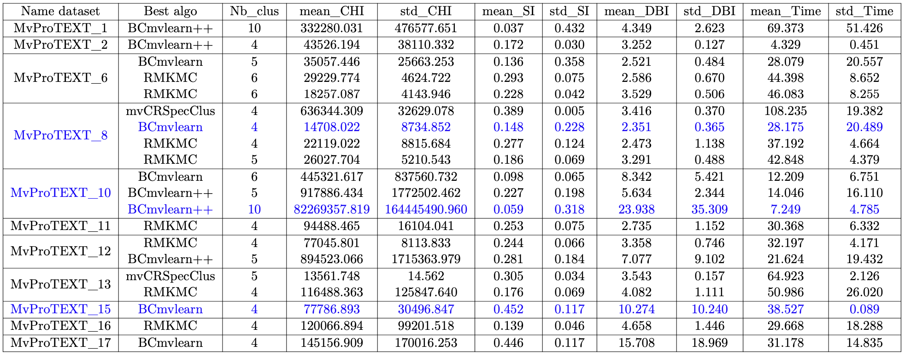

# Description

This repository includes the best multi-view clustering results of all the MvDatasets 

## First step -- Select the best clustering results by each index.

  
   
  <b>Fig1. The best 3 clustering results of each evaluation metric in different cases</b>

According to the results in the table above we choose to save 3 clustering results regarding to each clustering evaluation metric.

- Best mean_CHI : **BCmvlearn++** on **_MvProTEXT_10_** dataset with **10** clusters found
- Best mean_SI : **BCmvlearn** on **_MvProTEXT_15_** dataset with **4** clusters found
- Best mean_DBI : **BCmvlearn** on **_MvProTEXT_8_** dataset with **4** clusters found
  
## Second step -- Clustering visualization

  
   
  <b>Fig2. t_SNE visualization of BCmvlearn++ clustering results on "MvProTEXT_10" with 10 clusters founded and best mean_CHI score</b>

  
   
  <b>Fig3. t_SNE visualization of BCmvlearn clustering results on "MvProTEXT_15" with 4 clusters founded and best mean_SI score</b>

  
   
  <b>Fig4. t_SNE visualization of BCmvlearn clustering results on "MvProTEXT_8" with 4 clusters founded and best mean_DBI score</b>

The best clustering results are saved in the file named 

- **_BCmvlearn++10_mvProTEXT_10.xlsx_**
- **_BCmvlearn4_mvProTEXT_15.xlsx_**
- **_BCmvlearn4_mvProTEXT_8.xlsx_**

($\color{red}{\text{The clustering result files contain the original dataset information and a new column called 'label/class' which indicates the clustering results.}}$) 

