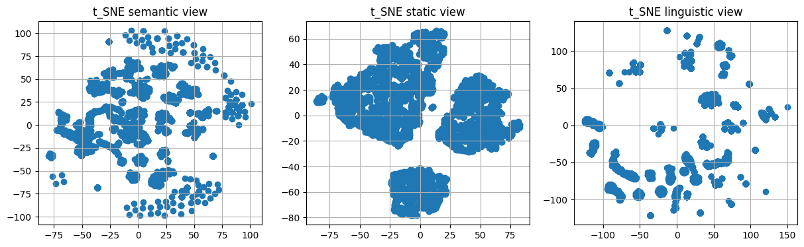
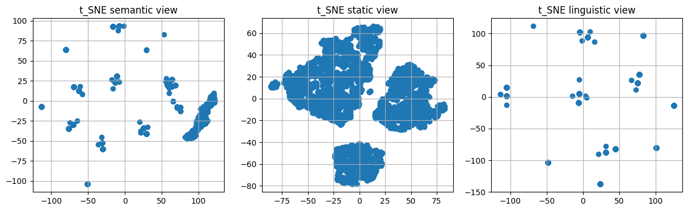

# Summary
After the steps of selecting the representative dataset in Single view section, the composition of multi-view datastes could be summarized as follow :

| MvDataset Name        | Semantic view                           | Static view   | Linguistic view        |
| --------------------- | --------------------------------------- | ------------- | ---------------------- |
| **_mvProTEXT_0_**     | _sentenceTransformer_pctpause_          |  _statistic_  | _camemBERT_pause_LSTM_ |
| **_mvProTEXT_1_**     | _sentenceTransformer_pctpause_          |  _statistic_  | _fastText_pause_LSTM_  |
| **_mvProTEXT_2_**     | _sentenceTransformer_pctpause_          |  _statistic_  | _word2vec_pause_LSTM_  | 
| **_mvProTEXT_3_**     | _sentenceTransformerCamemBERT_pctpause_ |  _statistic_  | _camemBERT_pause_LSTM_ |
| **_mvProTEXT_4_**     | _sentenceTransformerCamemBERT_pctpause_ |  _statistic_  | _fastText_pause_LSTM_  |
| **_mvProTEXT_5_**     | _sentenceTransformerCamemBERT_pctpause_ |  _statistic_  | _word2vec_pause_LSTM_  | 
| **_mvProTEXT_6_**     | _camemBERT_pause_LSTM_                  |  _statistic_  | _camemBERT_pause_LSTM_ |
| **_mvProTEXT_7_**     | _camemBERT_pause_LSTM_                  |  _statistic_  | _fastText_pause_LSTM_  |
| **_mvProTEXT_8_**     | _camemBERT_pause_LSTM_                  |  _statistic_  | _word2vec_pause_LSTM_  | 
| **_mvProTEXT_9_**     | _SpaCy_pause_LSTM_                      |  _statistic_  | _camemBERT_pause_LSTM_ |
| **_mvProTEXT_10_**    | _SpaCy_pause_LSTM_                      |  _statistic_  | _fastText_pause_LSTM_  |
| **_mvProTEXT_11_**    | _SpaCy_pause_LSTM_                      |  _statistic_  | _word2vec_pause_LSTM_  | 
| **_mvProTEXT_12_**    | _fastText_pause_LSTM_                   |  _statistic_  | _camemBERT_pause_LSTM_ |
| **_mvProTEXT_13_**    | _fastText_pause_LSTM_                   |  _statistic_  | _fastText_pause_LSTM_  |
| **_mvProTEXT_14_**    | _fastText_pause_LSTM_                   |  _statistic_  | _word2vec_pause_LSTM_  | 
| **_mvProTEXT_15_**    | _word2vec_pause_LSTM_                   |  _statistic_  | _camemBERT_pause_LSTM_ |
| **_mvProTEXT_16_**    | _word2vec_pause_LSTM_                   |  _statistic_  | _fastText_pause_LSTM_  |
| **_mvProTEXT_17_**    | _word2vec_pause_LSTM_                   |  _statistic_  | _word2vec_pause_LSTM_  | 

# MvDatasets visualization

  
   
  <b>Fig1. Visualization with t_SNE dimension reduction of dataset mvProTEXT_0</b>

  
   
  <b>Fig2. Visualization with t_SNE dimension reduction of dataset mvProTEXT_1</b>

  
   
  <b>Fig3. Visualization with t_SNE dimension reduction of dataset mvProTEXT_2</b>

  
   
  <b>Fig4. Visualization with t_SNE dimension reduction of dataset mvProTEXT_3</b>

  
   
  <b>Fig5. Visualization with t_SNE dimension reduction of dataset mvProTEXT_4</b>

  
   
  <b>Fig6. Visualization with t_SNE dimension reduction of dataset mvProTEXT_5</b>

  
   
  <b>Fig7. Visualization with t_SNE dimension reduction of dataset mvProTEXT_6</b>

  
   
  <b>Fig8. Visualization with t_SNE dimension reduction of dataset mvProTEXT_7</b>

  
   
  <b>Fig9. Visualization with t_SNE dimension reduction of dataset mvProTEXT_8</b>

  
   
  <b>Fig10. Visualization with t_SNE dimension reduction of dataset mvProTEXT_9</b>

  
   
  <b>Fig11. Visualization with t_SNE dimension reduction of dataset mvProTEXT_10</b>

  
   
  <b>Fig12. Visualization with t_SNE dimension reduction of dataset mvProTEXT_11</b>

  
   
  <b>Fig13. Visualization with t_SNE dimension reduction of dataset mvProTEXT_12</b>

  
   
  <b>Fig14. Visualization with t_SNE dimension reduction of dataset mvProTEXT_13</b>

  
   
  <b>Fig15. Visualization with t_SNE dimension reduction of dataset mvProTEXT_14</b>

  
   
  <b>Fig16. Visualization with t_SNE dimension reduction of dataset mvProTEXT_15</b>

  
   
  <b>Fig17. Visualization with t_SNE dimension reduction of dataset mvProTEXT_16</b>

  
   
  <b>Fig18. Visualization with t_SNE dimension reduction of dataset mvProTEXT_17</b>

# Results
The repository <a href="./BCmvlearn/">BCmvlearn</a> refers to the results of multi-view clustering.

The repository <a href="./IMBC/">IMBC</a> refers to the results of incremental multi-view clustering.
