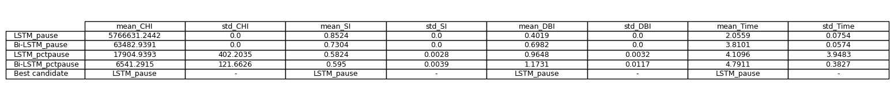
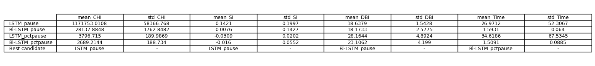
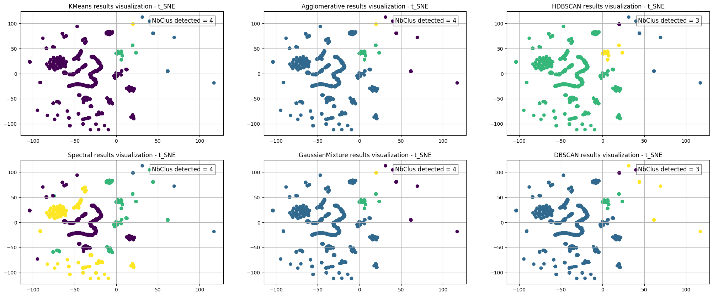
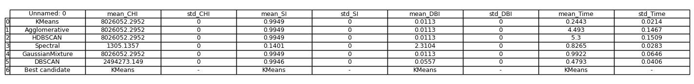
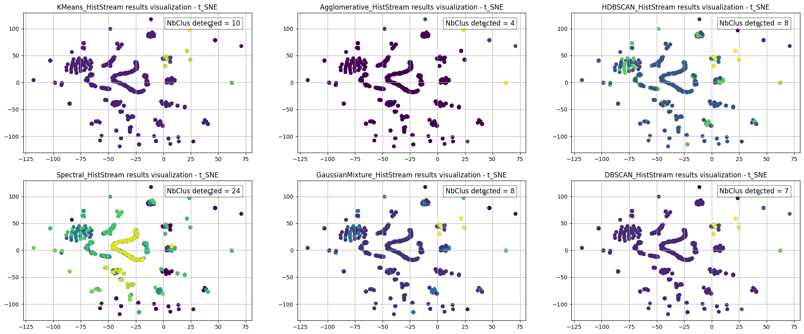
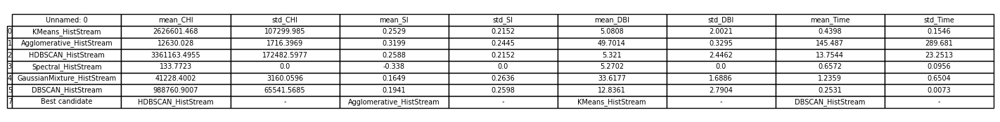

# Description

This repository includes the clustering (conventional and HistStream) results of dataset **_camemBERT_pause_LSTM.pickle_**

## First step -- Select the final representative dataset for clustering application.

- **_camemBERT_pause_LSTM_** : dataset obtained by applying $${\color{#326a95}camamBERT+LSTM}$$ as burst embedding model, trained to predict pause duration ($${\color{#326a95}pause}$$);
- **_camemBERT_pause_BiLSTM_** : dataset obtained by applying $${\color{#326a95}camamBERT+BiLSTM}$$ as burst embedding model, trained to predict pause duration ($${\color{#326a95}pause}$$);
- **_camemBERT_pctpause_LSTM_** : dataset obtained by applying $${\color{#326a95}camamBERT+LSTM}$$ as burst embedding model, trained to predict percentage of the pause duration ($${\color{#326a95}pctause}$$);
- **_camemBERT_pctpause_BiLSTM_** : dataset obtained by applying $${\color{#326a95}camamBERT+BiLSTM}$$ as burst embedding model, trained to predict percentage of the pause duration ($${\color{#326a95}pctpause}$$);

<p align="center">
  
  <br>
  <b>Fig1. Mean results of all clustering algorithms (using convnetional approaches)</b>
</p>

<p align="center">
  
  <br>
  <b>Fig2. Mean results of all clustering algorithms (using proposed HistStream framework)</b>
</p>

According to the mean results of each representation (tables above), choose the one that wins the most times in the 'Best candidate':

- pause_simpleLSTM (7 times)
- pctpause_doubleLSTM (1 time)

Finally, **pause_simpleLSTM** is chosen as the final representation based on CamemBERT with saved file name : **_camemBERT_pause_LSTM.pickle_**

```python
# Load dataset 

>>> import pickle
>>> with open('camemBERT_pause_LSTM.pickle', 'rb') as f:
      x = pickle.load(f)
>>> x.shape
... (5051, 384)
```
## Second step -- Clustering application

<p align="center">
  
  <br>
  <b>Fig3. Clustering visualization of each clustering algorithm (using convnetional approaches)</b>
</p>

<p align="center">
  
  <br>
  <b>Fig4. Mean results of each clustering algorithm (using convnetional approaches)</b>
</p>

**KMeans** win the most, save the clustering results in the file named **_camemBERT_pause_LSTM_KMeans.xlsx_** 

<p align="center">
  
  <br>
  <b>Fig5. Clustering visualization of each clustering algorithm (using proposed HistStream framework)</b>
</p>

<p align="center">
  
  <br>
  <b>Fig6. Mean results of each clustering algorithm (using proposed HistStream framework)</b>
</p>

Since no one win the most, according to the visulization results, save the clustering results of **HDBSCAN_HistStream** with saved file name **_camemBERT_pause_LSTM_HDBSCAN_HistStream.xlsx_** 

## Summary

- Burst embedding results for use : **_camemBERT_pause_LSTM.pickle_**   
- Clustering results : **_camemBERT_pause_LSTM_KMeans.xlsx_** and **_camemBERT_pause_LSTM_HDBSCAN_HistStream.xlsx_**

($\color{red}{\text{The clustering result files contain the original dataset information and a new column called 'label/class' which indicates the clustering results.}}$)


