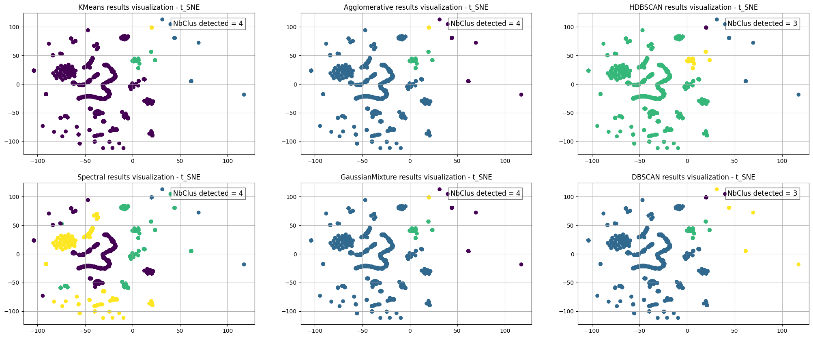
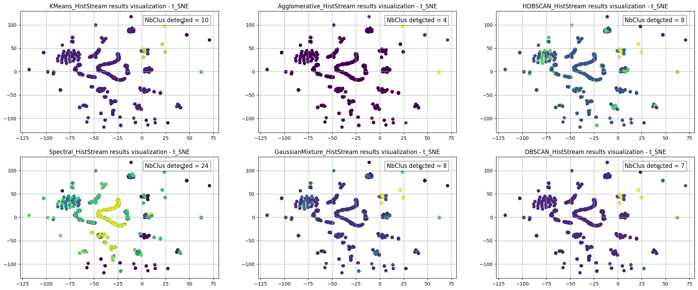

# Explain

Since KMeans win the most, save only the clustering results of KMeans 
Saved file name => _camemBERT_pause_LSTM_KMeans.xlsx_

Since no one win the most, according to the visulization results, save the clustering results of HDBSCAN_HistStream
Saved file name => _camemBERT_pause_LSTM_HDBSCAN_HistStream.xlsx_

