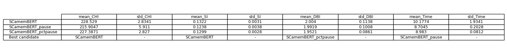
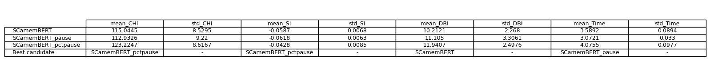
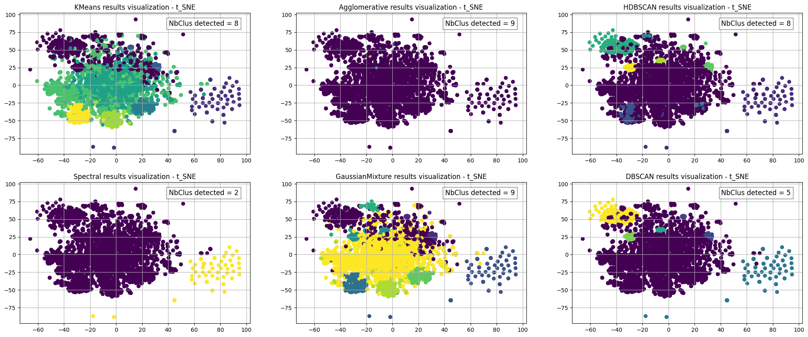
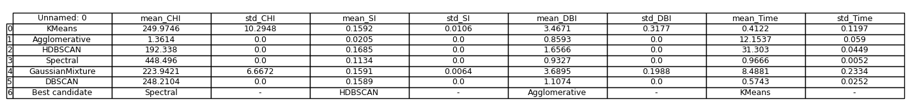
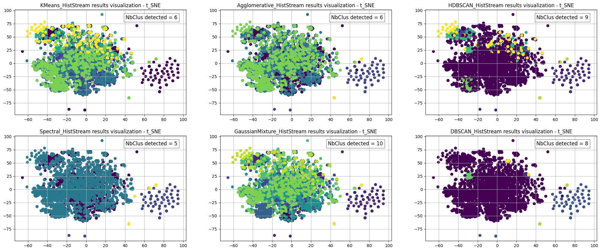
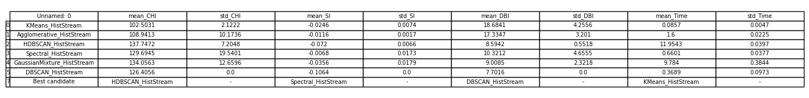

# Description

This repository includes the clustering (conventional and HistStream) results of dataset **_senternceTransformerCamemBERT_pctpause.pickle_**

## First step -- Select the final representative dataset for clustering application.

- **_senternceTransformerCamemBERT_** : dataset obtained by applying $${\color{#326a95}senternceTransformerCamemBERT}$$ as burst embedding model directly;
- **_senternceTransformerCamemBERT_pause.pickle_** : dataset obtained by applying $${\color{#326a95}senternceTransformerCamemBERT}$$ as burst embedding model, trained to predict pause duration ($${\color{#326a95}pause}$$);
- **_senternceTransformerCamemBERT_pctpause.pickle_** : dataset obtained by applying $${\color{#326a95}senternceTransformerCamemBERT}$$ as burst embedding model, trained to predict percentage of the pause duration ($${\color{#326a95}pctause}$$);

<p align="center">
  
  <br>
  <b>Fig1. Mean results of all clustering algorithms (using convnetional approaches)</b>
</p>

<p align="center">
  
  <br>
  <b>Fig2. Mean results of all clustering algorithms (using proposed HistStream framework)</b>
</p>

According to the mean results of each representation (tables above), choose the one that wins the most times in the 'Best candidate':

- sentenceTransCT_pctpause (6 times)
- sentenceTransCT_pause (1 time)
- sentenceTransCT (1 time)

Finally, **sentenceTransCT_pctpause** is chosen as the final representation based on SpaCy with saved file name : **_senternceTransformerCamemBERT_pctpause.pickle_**

```python
# Load dataset 

>>> import pickle
>>> with open('senternceTransformerCamemBERT_pctpause.pickle', 'rb') as f:
      x = pickle.load(f)
>>> x.shape
... (5051, 1024)
```
## Second step -- Clustering application

<p align="center">
  
  <br>
  <b>Fig3. Clustering visualization of each clustering algorithm (using convnetional approaches)</b>
</p>

<p align="center">
  
  <br>
  <b>Fig4. Mean results of each clustering algorithm (using convnetional approaches)</b>
</p>

**GaussianMixture** win the most, save the clustering results in the file named **_sentenceTransformerCamemBERT_pctpause_GaussianMixture.xlsx_** 

<p align="center">
  
  <br>
  <b>Fig5. Clustering visualization of each clustering algorithm (using proposed HistStream framework)</b>
</p>

<p align="center">
  
  <br>
  <b>Fig6. Mean results of each clustering algorithm (using proposed HistStream framework)</b>
</p>

**DBSCAN_HistStream** win the most, save the clustering results in the file named **_sentenceTransformerCamemBERT_pctpause_DBSCAN_HistStream.xlsx_** 

## Summary

- Burst embedding results for use : **_senternceTransformerCamemBERT_pctpause.pickle_**   
- Clustering results : **_sentenceTransformerCamemBERT_pctpause_GaussianMixture.xlsx_** and **_sentenceTransformerCamemBERT_pctpause_DBSCAN_HistStream.xlsx_**

($\color{red}{\text{The clustering result files contain the original dataset information and a new column called 'label/class' which indicates the clustering results.}}$) 
