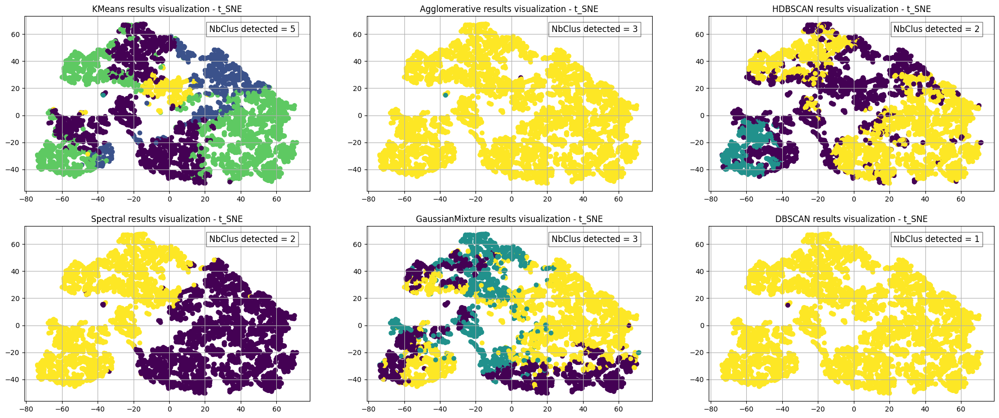
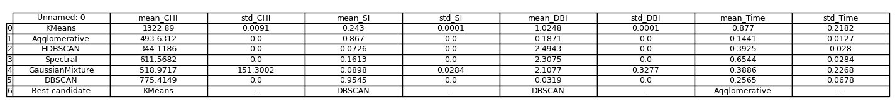
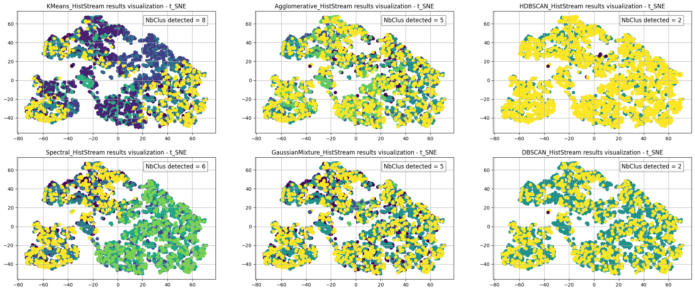
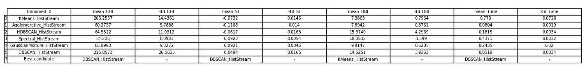

# Description

This repository includes the clustering (conventional and HistStream) results of dataset **_statistic.pickle_**

```python
# Load dataset 

>>> import pickle
>>> with open('statistic.pickle', 'rb') as f:
      x = pickle.load(f)
>>> x.shape
... (5051, 13)
```
## Clustering application

<p align="center">
  
  <br>
  <b>Fig3. Clustering visualization of each clustering algorithm (using convnetional approaches)</b>
</p>

<p align="center">
  
  <br>
  <b>Fig4. Mean results of each clustering algorithm (using convnetional approaches)</b>
</p>

**DBSCAN** win the most, save the clustering results in the file named **_statistic_DBSCAN.xlsx_** 

<p align="center">
  
  <br>
  <b>Fig5. Clustering visualization of each clustering algorithm (using proposed HistStream framework)</b>
</p>

<p align="center">
  
  <br>
  <b>Fig6. Mean results of each clustering algorithm (using proposed HistStream framework)</b>
</p>

**DBSCAN_HistStream** win the most, save the clustering results in the file named **_statistic_DBSCAN_HistStream.xlsx_** 

## Summary

- Clustering results : **_statistic_DBSCAN.xlsx_** and **_statistic_DBSCAN_HistStream.xlsx_**

($\color{red}{\text{The clustering result files contain the original dataset information and a new column called 'label/class' which indicates the clustering results.}}$) 

